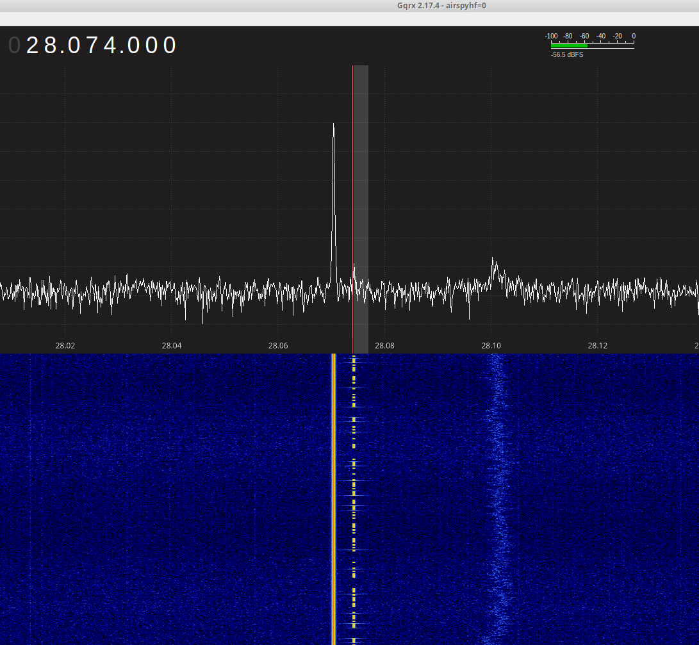

## Info

I managed to combine dawsonjon's RX-Quadrature-clocks code with that of R2BDY's
TX code - all using a single Pico 2!

https://github.com/kholia/pico-hf-oscillator/tree/THE_MERGER - Code is open
here.

This allows creation of transceivers powered entirely by Pico! No Si5351
needed ;)

Performance was checked and posted earlier and is good enough!

## References

- https://github.com/kholia/pico-hf-oscillator

- https://github.com/dawsonjon/PicoRX
